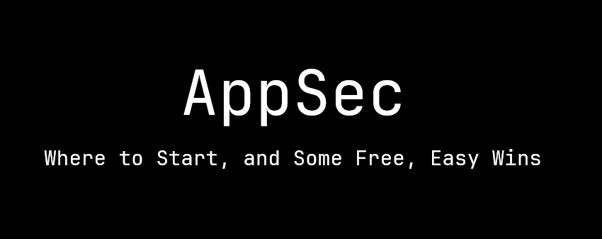

<div align="center">
  
</div >


# Tools Used
1. CycloneDX/cyclonedx-node-npm: Offical OWASP tool for generating CycloneDX Software Bill of Materials (SBOM) from npm projects
	* https://github.com/CycloneDX/cyclonedx-node-npm

2. DependencyTrack: SBOM/Software Component Analysis visualisation platform
	* https://docs.dependencytrack.org/getting-started/deploy-docker/

3. Semgrep: Static code analysis tool
	* https://semgrep.dev/
	* https://semgrep.dev/docs/getting-started/

# Pre-requisites
All you need to have installed is [Docker](https://docs.docker.com/engine/install/).

If you'd like to create your own SBOM from an NPM project, you'll need [Node](https://github.com/nvm-sh/nvm) along with the `cyclonedx-node-npm` tool linked above.

> (I used `nvm install --lts && nvm use --lts` when I was putting together the demo, which at the time of writing was Node v20.11.1)

# Importing `bom.json` Into DependencyTrack
1. From this directory, run:
```bash
docker compose up -d
```

2. Open your browser and navigate to `http://localhost:8080`.
3. Login (default credentials are `admin:admin`).
4. Navigate to `Projects` from the application's menu.
5. Create a project. The name and version can be set to anything. Set `Classifier` to `Application`.
6. Open your new project and navigate to the `Components` tab.
7. Upload `sbom.json` found in the `juice_shop` directory of this repository.
8. Give it a couple of minutes and then refresh and you should see results!
 
# Running Semgrep in a Github Action
1. Add the `semgrep-offline-sast-gh-action.yml` file into project that you want to scan. The file must be placed in the `.github/workflows` directory. If it doesn't exist, no worries, just create one! :)
2. Navigate to the `Settings` tab of your repository, and click `Actions` in the sub-menu.
3. Set the permissions to `Allow <username>, and select non-<username>, actions and reusable workflows`. Check the `Allow actions created by Github` as well.
4. Navigate to the `Actions` tab of your repository, select `Semgrep SAST` from the `Workflows` list on the left of the page.
5. Open the `Run workflow` drop-down menu on the right of the page, and select the branch you want to scan, and click `Run workflow`.
6. Wait until it finishes, and then click into the workflow. Down the bottom you should see an artifact you can download called: `semgrep-report`

